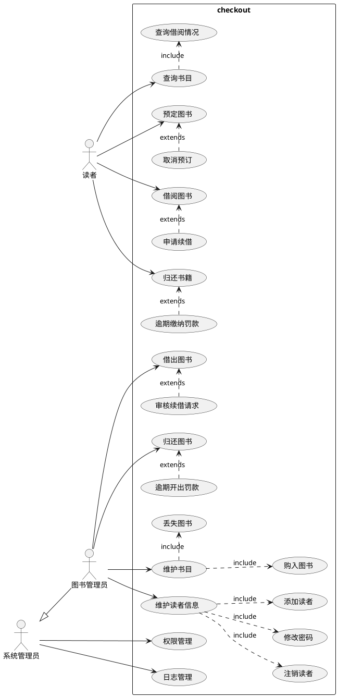
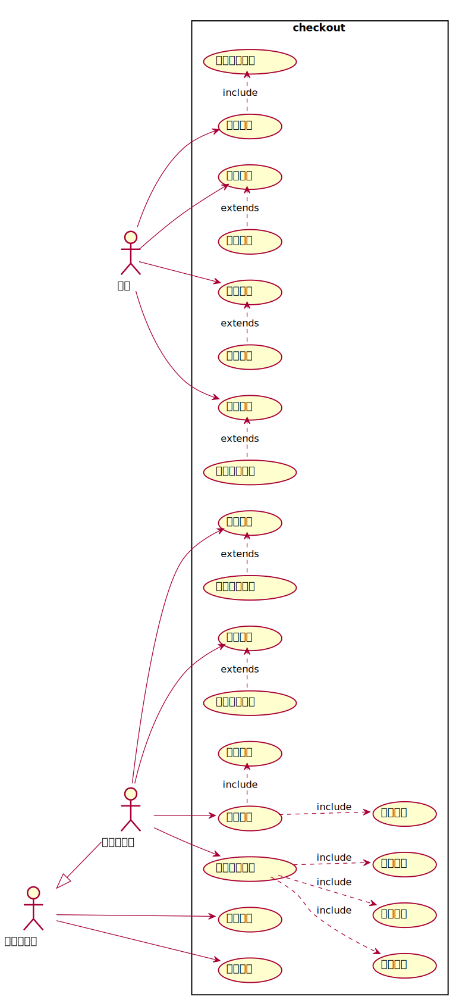
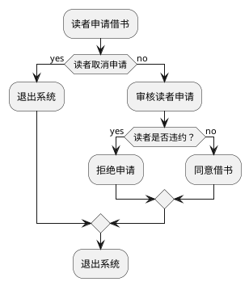
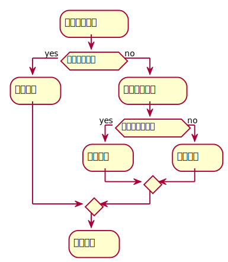

# 实验2：图书管理系统用例建模
|   学号       |      班级      |      姓名    |
|:------------:|:-------------:|:-----------:|
|201710414207|     17软工2班    |   李浩     |
##  1.图书管理系统的用例关系图
###1.1用例图PlantUML源码如下：

###1.2 用例图如下：

##2. 参与者说明：
###2.1 图书管理员
主要功能   
1.借出图书：图书管理员把书借给读者；审核读者的续借请求。  
2.归还图书：图书管理员收纳整理读者归还的图书；对于逾期未归还的开出罚单。  
3.维护书目：图书管理员对购买的书籍进行登记，对丢失的书籍进行注销。
4.维护读者信息：图书管理员添加新注册读者的信息，删除已经注销身份的读者，辅助读者修改密码。

###2.2 读者
1.借阅图书：读者从图书管理员出借书；可向图书管理员申请续借。  
2.归还书籍：读者把书籍归还给图书管理员；  
3.预定图书：读者申请预定图书；也可取消预订。  
4.查询书目：读者通过书名等信息查询图书，包括图书的借阅情况。  

###2.3 系统管理员
1.权限管理：系统分配不同身份用户的权限，这里主要是图书管理员和读者两类角色。  
2.日志管理：系统对于用户的操作生成日志并保存。
##3. 用例规约表
###3.1 “借出图书”用例
<caption>表1 “借出图书”用例规约</caption>
<table>   
    <tr>
        <th>用例名称</th>
        <th>借出图书</th>
    </tr>
    <tr>
    <td>参与者</td>
    <td>图书管理员</td>
    </tr>
    <tr>
    <td>前置条件</td>
    <td>图书管理员收到读者借书请求</td>
    </tr> 
    <tr>
    <td>后置条件</td>
    <td>读者成功借阅书本，该书籍的数目信息改变。</td>
    </tr>     
</table>
主事件流
<table>
    <tr>
        <th>参与者动作</th>
        <th>系统行为</th>
    </tr>
    <tr>
        <td></td>
        <td>1.系统列出读者借书请求的所有信息；</td>
    </tr>
    <tr>
        <td>2.管理员审核读者申请</td>
        <td></td>
    </tr>
    <tr>
        <td></td>
        <td>3.系统返回申请结果，用例结束；</td>
    </tr>        
</table>
备选事件流  
<table>
    <tr>
    <td>1a.用户取消借阅请求 </td>
    </tr>
    <tr>
    <td>&nbsp;&nbsp;&nbsp;&nbsp;1.系统提示申请取消，用例结束</td>
    </tr>
    <tr>
    <tr>
    <td>1b.用户为续借 </td>
    </tr>
    <tr>
    <td>&nbsp;&nbsp;&nbsp;&nbsp;1.系统同意借书请求，周期为30天，用例结束</td>
    </tr>
    <tr>
    <td>2a.读者有违规情况 </td>
    </tr>
    <tr>
    <td>&nbsp;&nbsp;&nbsp;&nbsp;1.系统提示读者违规，拒绝结束请求，用例结束</td>
    </tr>        
</table>
 业务规则
 <table>
    <tr>
        <td>1.一个借书请求可以包含多本书籍，每次借书时间由读者自己设定，时间不超过30天。</td>
        <td>2.每次续借时长为30天，每本书仅能续借一次。</td>
        <td>3.读者可发送多个借书请求，但允许同时借出的书目不超过4本。</td>
    </tr>
 </table>

##### “借出图书”用例流程图源码如下：

#####“借出图书”用例流程图如下：

