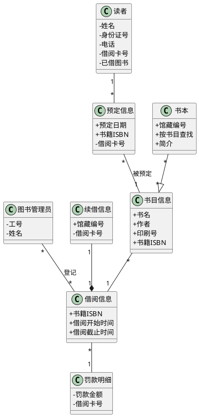
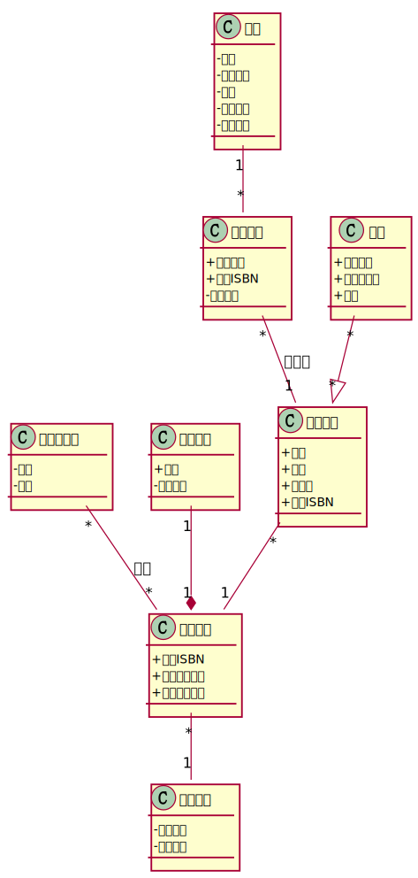
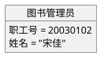
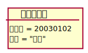
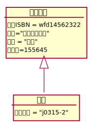

# 实验3：图书管理系统领域对象建模
|   学号       |      班级      |      姓名    |
|:------------:|:-------------:|:-----------:|
|201710414207|     17软工2班    |   李浩     | 
|-----------|--------------|-------------|
##  1.图书管理系统的类图
### 1.1类图PlantUML源码如下：

### 1.2 类图如下：

### 1.3类图说明：
1.读者类：属性有姓名、身份证号、电话、借阅卡号、已借图书等属性。读者和预定信息为1对多的关联关系，一个读者可以预定多本书籍。  
2.图书管理员类：属性有工号、姓名等，和借阅信息为1对多的关联关系，一个管理员可以处理多个借阅信息。  
3.书目信息类：有书名、作者、印刷号、书籍ISBN属性，用于记录一类书目，和书本是1对多的继承关系，1个书目信息包含多个书本，即一类书中可能存在多本书；书本继承书目信息。     
4.书本类：有馆藏编号、按书目查找、简介等属性，同时继承了书目信息类的属性，是具体的某一本书。  
5.借阅信息类：有书籍ISBN、馆藏编号、借阅开始时间、借阅截止时间等属性，与书目信息为一对多关联关系，一个借阅信息可能包含多本书目；与续借信息为一对一的聚合关系，只能续借一次；与罚款明细为多对一的关联关系，多个借阅记录对应一次罚款明细。
6.罚款明细类：有罚款金额、借阅卡号等属性。
7.续借信息类：有借阅卡号、馆藏编号等属性。
## 2. 图书管理系统的对象图
### 2.1 类图书管理员的对象图
#### 源码如下：

#### 对象图如下：


### 2.2 类书目信息和书本的对象图
#### 源码如下：
````puml
@startuml
object 书目信息
object 书本
书目信息<|--书本
object 书目信息 {
  书籍ISBN = wfd14562322
  书名="世界如此美妙"
  作者 = "喃喃"
  印刷号=155645
}
object 书本 {
  馆藏编号 = "j0315-2"
}

@enduml
````
#### 对象图如下：

