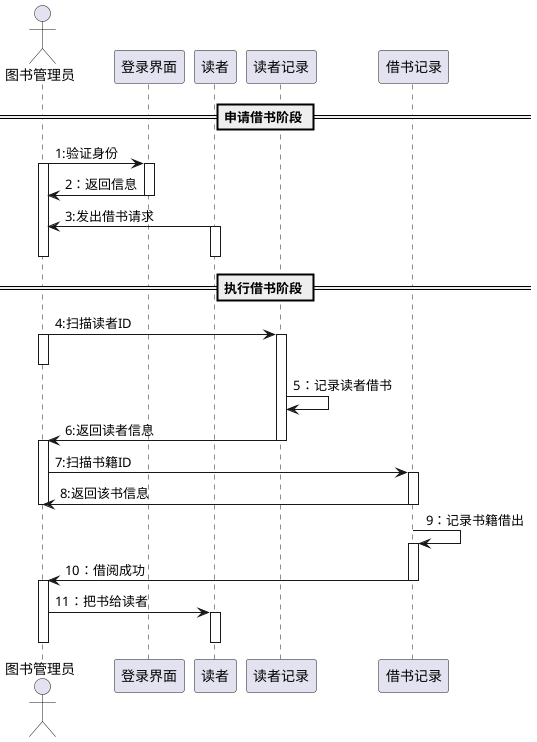
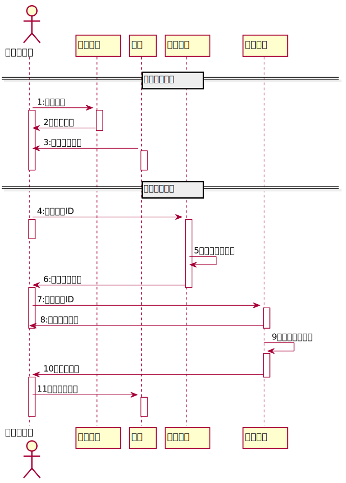
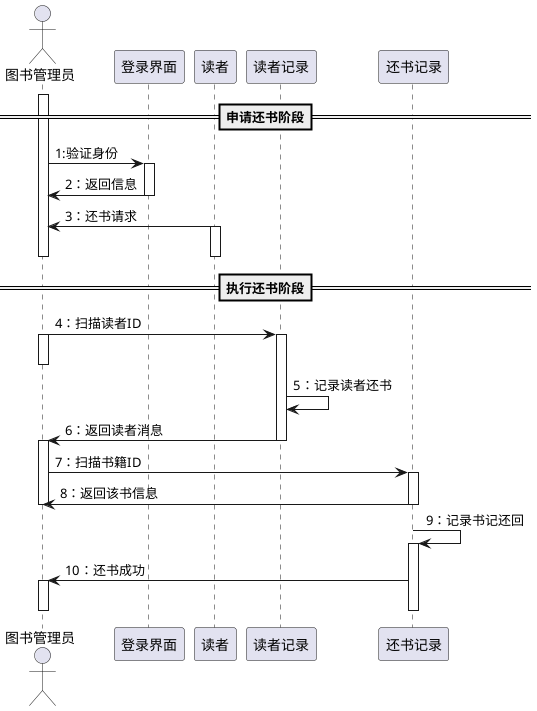
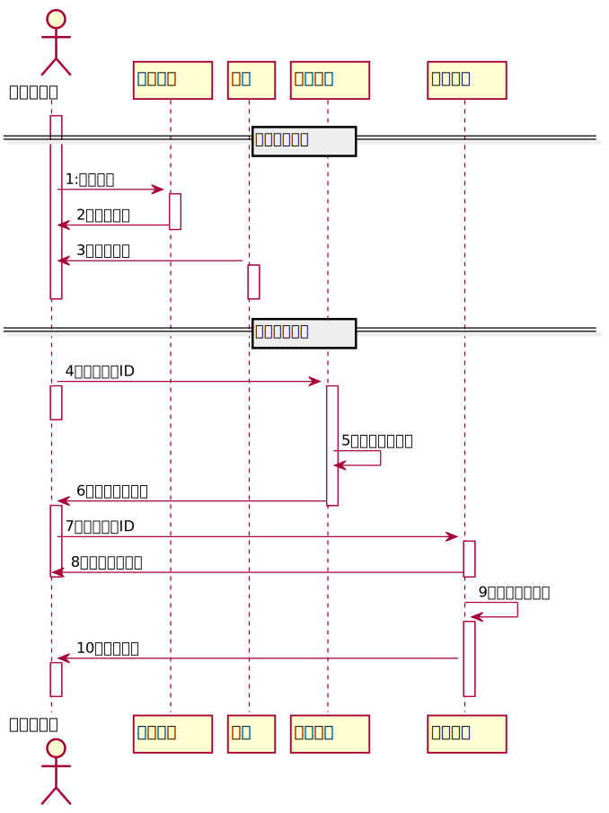

# 实验4：图书管理系统顺序图绘制
|   学号       |      班级      |      姓名    |
|:------------:|:-------------:|:-----------:|
|201710414207|     17软工2班    |   李浩     | 
|-----------|--------------|-------------|
##  图书管理系统的顺序图
### 1.借书用例
#### 1.1 借书用例PlantUML源码

#### 1.2 借书用例顺序图

#### 1.3 借书用例顺序图说明
借书时，图书管理员需要先登录系统，通过系统验证登录成功；   
读者向图书管理员发出借书请求，图书管理员扫描读者ID，如果读者没有违规情况，则记录读者借书，系统返回读者最新的信息；  
图书管理员扫描书籍ID，得到书籍信息，记录书记借出；  
系统返回借书成功，图书管理员把书交给读者。
### 2.还书用例
#### 2.1 还书用例PlantUML源码

#### 2.2 还书用例顺序图

#### 2.3 还书用例顺序图说明
还书时，图书管理员需要先登录系统，通过系统验证登录成功；  
读者向图书管理员申请还书；  
图书管理员扫描读者ID,记录读者还书，系统更新并返回读者当前的信息；  
图书管理员扫描书籍，记录书籍归还，系统更新并返回该书当前的信息；  
系统返回还书成功。
  
