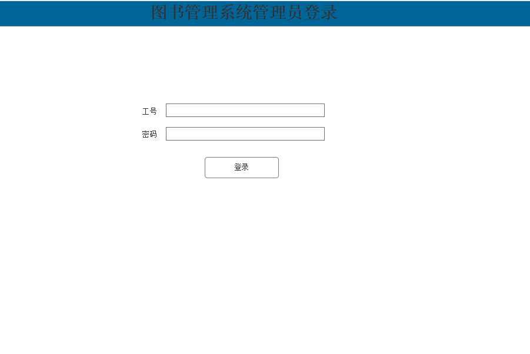
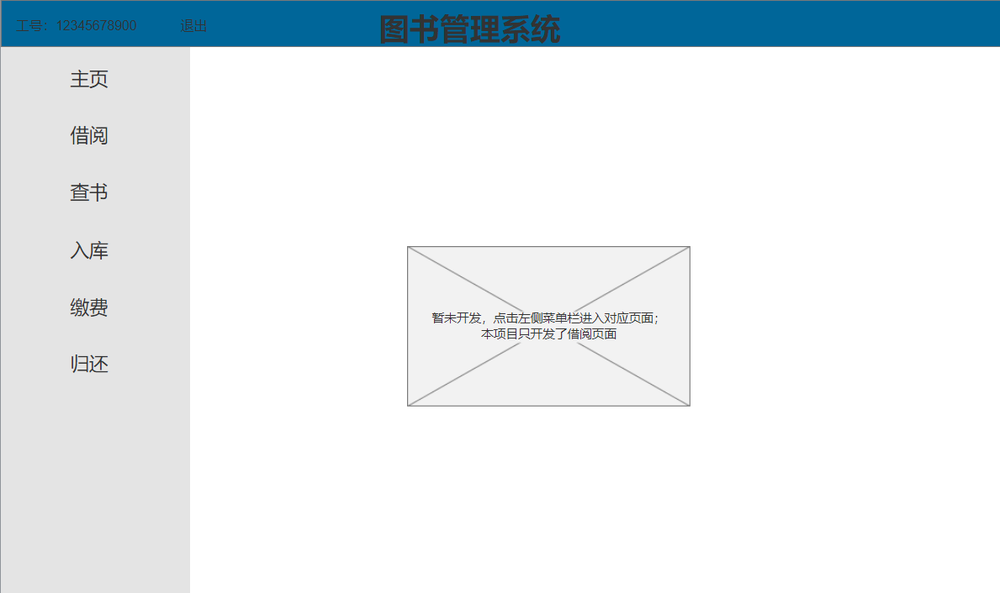
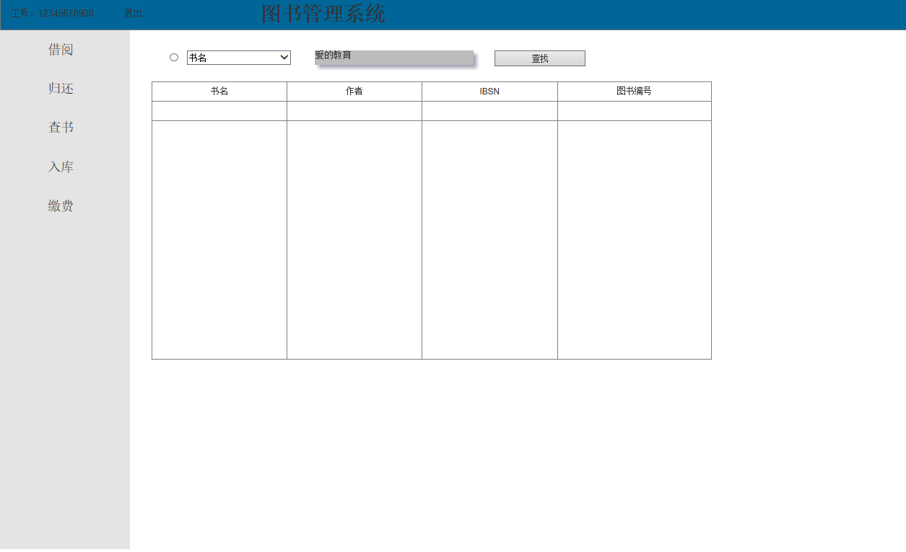
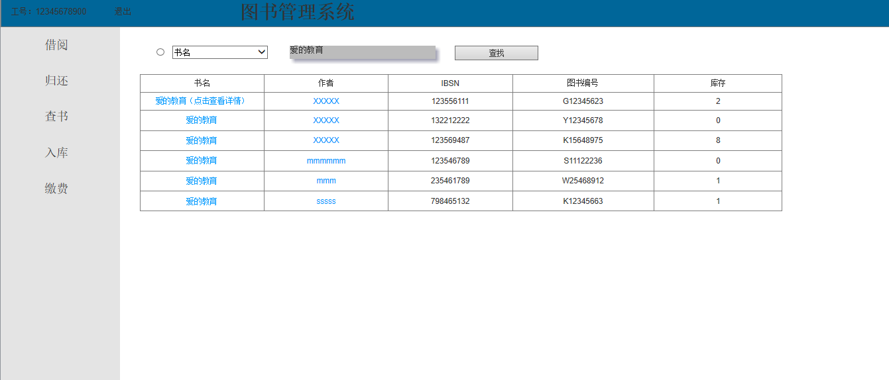
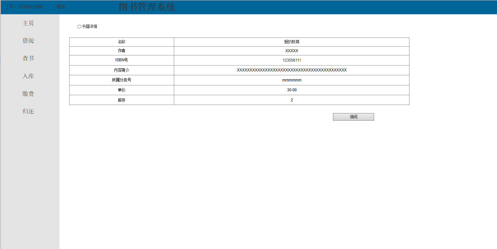
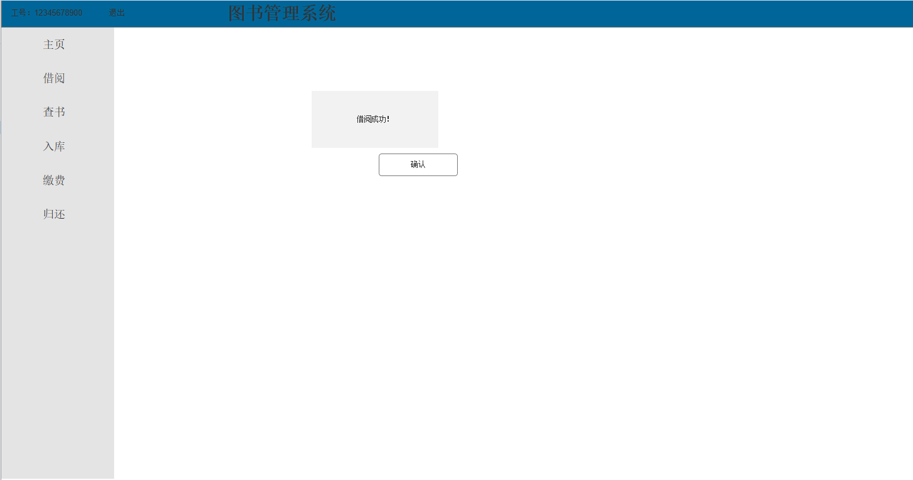

# 实验5：图书管理系统数据库设计与界面设计
|   学号       |      班级      |      姓名    |
|:------------:|:-------------:|:-----------:|
|201710414207|     17软工2班    |   李浩     | 
|-----------|--------------|-------------|
## 1.数据库表设计
### 1.1. 图书表
|数据项名称|   字段   |      类型   |    主键，外键  |    可以为空  |   默认值     |      说明    |  
|:-------:|:-------:|:-----------:|:-------------:|:-----------:|:-----------:|:------------:|
|图书编号 |BookNo |  char(12)    |      主键     |    Not Null |     null         |“ISBN号”+三位流水号“XXX” |
|ISBN号 |ISBN |  char(12)    |           |    Not Null |       null        |     通用标准        |
|名称 |BName |  varchar(50)    |           |    Not Null |          null     |     50个字符内        | 
|作者 |Writer |  varchar(30)    |           |    Not Null |       null        |       30个字符内      |
|出版地 |Address|  varchar(50)    |           |    Not Null |      null         |        50个字符内     |
|内容简介 |Introduction|  varchar(50)    |           |    Not Null |      null         |        50个字符内     |
|所属分类号 |ClassifyNo|  varchar(10)    |           |    Not Null |      null         |        10个字符内，“A-Z”+“0-9”     |
|单价 |Price|  numeric(10,2)    |           |    Not Null |      null         |        0至10^10     |
### 1.2. 读者表
|数据项名称|   字段   |      类型   |    主键，外键  |    可以为空  |   默认值     |      说明    |  
|:-------:|:-------:|:-----------:|:-------------:|:-----------:|:-----------:|:------------:|
|读者号 |ReaderNo |  char(11)    |      主键     |    Not Null |     null         |11个字符 |
|读者姓名 |ReaderName |  char(20)    |           |    Not Null |       null        |     20个字符内        |
|读者性别 |ReaderSex |  char(2)    |           |    Not Null |          null     |     2个字符，“男”或“女”        | 
|读者身份证号 |ReaderIDCard |  char(17)    |           |    Not Null |       null        |       17个字符     |
|读者电话 |ReaderTel|  char(11)    |           |    Not Null |      null         |        11个字符     |
|读者类型 |ReaderType|  varchar(20)    |           |    Not Null |      null         |20个字符内，“科研人员”、“教师”、“非教研人员”、“博士研究生”、“硕士研究生”、“本专科生”     |
### 1.3图书管理员表
|数据项名称|   字段   |      类型   |    主键，外键  |    可以为空  |   默认值     |      说明    |  
|:-------:|:-------:|:-----------:|:-------------:|:-----------:|:-----------:|:------------:|
|图书管理员编号 |LibrarianNo |  char(11)    |      主键     |    Not Null |     null         |11个字符 |
|图书管理员姓名 |LibrarianName |  char(20)    |           |    Not Null |       null        |     20个字符内        |
|图书管理员性别 |LibrarianSex |  char(2)    |           |    Not Null |          null     |     2个字符，“男”或“女”        | 
|图书管理员身份证号 |LibrarianIDCard |  char(17)    |           |    Not Null |       null        |       17个字符     |
|图书管理员电话 |LibrarianTel|  char(11)    |           |    Not Null |      null         |        11个字符     |
|图书管理员电子邮箱 |LibrarianEmail|  varchar(30)    |           |    Not Null |      null         |        30个字符内     |
### 1.4书目分类表
|数据项名称|   字段   |      类型   |    主键，外键  |    可以为空  |   默认值     |      说明    |  
|:-------:|:-------:|:-----------:|:-------------:|:-----------:|:-----------:|:------------:|
|所属分类号 |ClassifyNo |  varchar(10)    |      主键     |    Not Null |     null         |10个字符内，“A-Z”+“0-9” |
|所属分类名称 |ClassifyName |  varchar(30)    |           |    Not Null |       null        |     30个字符内        |

### 1.5预定信息登记表
|数据项名称|   字段       |      类型      |      主键，外键    |      可以为空    |      默认值 |      说明    |  
|:-------:|:------------:|:-------------:|:-----------:|:-----------:|:-----------:|:-----------:|
|图书编号 |BookNo |  char(12)    |      主键     |    Not Null |     null         |“ISBN号”+三位流水号“XXX” |
|读者号 |ReaderNo |  char(11)    |      主键     |    Not Null |     null         |11个字符 |
|预定日期 |OrderDate |  datetime    |           |    Not Null | null |   yyyy-mm-dd         |
### 1.6借阅信息登记表
|数据项名称|   字段       |      类型      |      主键，外键    |      可以为空    |      默认值 |      说明    |  
|:-------:|:------------:|:-------------:|:-----------:|:-----------:|:-----------:|:-----------:|
|图书编号 |BookNo |  char(12)    |      主键     |    Not Null |     null         |“ISBN号”+三位流水号“XXX” |
|读者号 |ReaderNo |  char(11)    |      主键     |    Not Null |     null         |11个字符 |
|ISBN号 |ISBN |  char(12)    |           |    Not Null |       null        |     通用标准        |
|初次借阅日期 |InitialBorrowDate |  datetime    |           |    Not Null | null |   yyyy-mm-dd         |
|应还日期 |LastBackDate |  datetime    |           |    Not Null | null  |   yyyy-mm-dd         |
|实际归还日期 |BackDate |  datetime    |           |    Not Null | null |   yyyy-mm-dd         |
|续借时间 |ReBorrowDate |  datetime    |           |    Not Null | null |   yyyy-mm-dd         |
|罚款 |Penalty |  numeric(10,2)    |           |    Not Null | 0   |   0至10^10.00         |
### 1.7借阅详情表
|数据项名称|   字段       |      类型      |      主键，外键    |      可以为空    |      默认值|      说明    |  
|:-------:|:------------:|:-------------:|:-----------:|:-----------:|:-----------:|:-----------:|
|读者类型 |ReaderType |  varchar(20)    |      主键     |    Not Null |     null         |20个字符内，“科研人员”、“教师”、“非教研人员”、“博士研究生”、“硕士研究生”、“本专科生” |
|借阅种类 |BookType |  varchar(10)    |      主键     |    Not Null |     null         |10个字符内，“中文图书”、“外文图书”、 “短期外借” |
|借阅时长 |BorrowDays |  numeric(10,0)    |           |    Not Null |       0        |       0至10^10.00      |
|续借次数 |Number |  numeric(10,0)    |           |    Not Null | 0 |   0至10^10.00         |
|续借天数 |ReBorrowDays |  numeric(10,0)    |           |    Not Null | 0  |   0至10^10.00         |
|借书总册数 |Total |  numeric(10,0)    |           |    Not Null | 0   |   0至10^10.00         |


## 2. 界面设计







### 2.1. 借书界面设计
参见用例：借书用例  
类图参见：结束类，读者类，图书类  
顺序图：借书顺序图  
1.验证登录合法性    
*功能：用于获取全部分类  
*请求地址：http://SCLibrary/lh/api/index  
*请求方法：Post  
*请求参数:  

|参数名称|     必填 |    说明    |  
|:------:|:--------:|:--------:|
|LibrarianNo|     是    |   用于验证请求合法性的认证信息     | 
|Password|     是    |   用于验证请求合法性的认证信息     | 
|method|     是    |   固定为 “GET”     | 
```
{
    "info": "登陆成功",
    "data": {
        LibrarianNo："12345678901"
        LibrarianName："宋人"
        LibrarianSex："男"
        LibrarianIDCard："51111112345612222221"
        LibrarianTel："154257571"
        LibrarianEmail："455645566@qq.com"
    },
    "code": 200
}
```


|   参数名称       |      说明      |
|:------------:|:-------------:|
|Info|     返回信息    |
|data|     用户返回的个人信息    | 
|code|     返回码    | 


2.获取借阅书籍信息    
*功能：用于获取书籍信息  
*请求地址：http://SCLibrary/lh/api/book
*请求方法：Post  
*请求参数:  

|   参数名称       |      必填      |      说明    |
|:------------:|:-------------:|:-----------:|
|BName|     是    |   用于验证请求合法性的认证信息     | 
|method|     是    |   固定为 “GET”     | 
```
{
    "info": "查询成功",
    "data": {
        BookNo："G126545232"
        ISBN："123456789"
        BName："爱的教育"
        Writer："XXXXXx"
        Address："四川"
        Introduction："关于爱与教育的故事"
        ClassifyNo:"K12654655"
        Price:"30.00"
    },
    "code": 200
}
```


|   参数名称       |      说明      |
|:------------:|:-------------:|
|Info|     返回信息    |
|data|     系统返回的书本信息    | 
|code|     返回码    | 

3.获取借阅信息    
*功能：用于获取借阅信息  
*请求地址：http://SCLibrary/lh/api/borrow  
*请求方法：Post  
*请求参数:  

|   参数名称    |      必填      |      说明    |
|:------------:|:-------------:|:-----------:|
|BookNo|     是    |   用于验证请求合法性的认证信息     | 
|method|     是    |   固定为 “GET”     | 
```
{
    "info": "借阅成功",
    "data": {
        BookNo："G126545232"
        ReaderNo:"G355556564"
        InitialBorrowDate:"2019-12-30"
        LastBackDate:"2020-1-30"
        BackDate:"2020-2-30"
        ReBorrowDate:"2020-1-29"
        Penalty:"0"
    },
    "code": 200
}
```

|   参数名称       |      说明      |
|:------------:|:-------------:|
|Info|     返回信息    |
|data|     系统返回的借阅信息    | 
|code|     返回码    |  