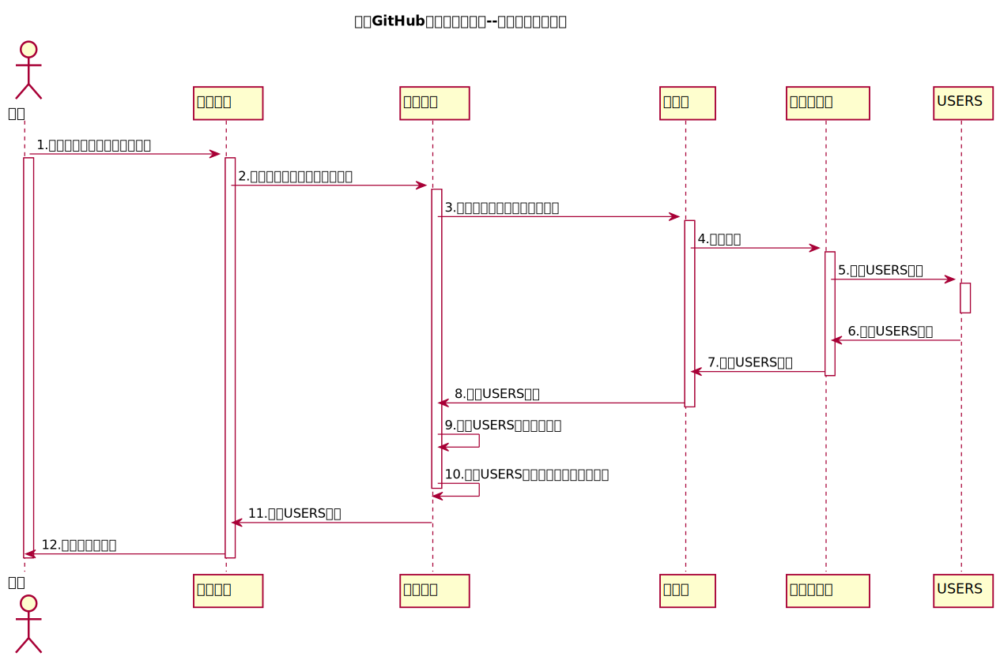

<!-- markdownlint-disable MD033-->
<!-- 禁止MD033类型的警告 https://www.npmjs.com/package/markdownlint -->

# “登录”用例 [返回](../README.md)

## 1. 用例规约

|用例名称|登录|
|-------|:-------------|
|功能|登录平台|
|参与者|访客|
|前置条件|登陆者为该系统用户，已有相应的用户号和密码 |
|后置条件|登录成功后，跳转到主页|
|主事件流| 1.用户进入系统的登陆界面  2.输入用户名（学号或工号）  3.输入密码   4.选择身份，点击登录  5.成功登录系统 6.系统在客户端以Cookie形式存储登录用户信息，保持登录的持久性。|
|备选事件流|1a. 输入的用户名或者密码为空  &nbsp;&nbsp; 1.提示重新输入   &nbsp;&nbsp; 2.访客重新提交登录信息  2a.系统判断用户名，密码，用户类不正确，不允许登录  &nbsp;&nbsp; 1.提示重新输入   &nbsp;&nbsp; 2.访客重新提交登录信息  2a.用户的登陆名在数据库中未找到，显示“用户名不存在的信息”  4a.输入的密码和数据库中的密码不一致，显示“密码错误信息”|

## 2. 业务流程[源码](../src/login.puml)

## 3. 界面设计
- 界面参照: https://jiangnhao.github.io/is_analysis/test6/ui/login.html
- API接口调用
    - 接口1：[login](../接口/login.md)

## 4. 算法描述 
无
    
## 5. 参照表

- [USERS](../DataBase.md/#USERS)
