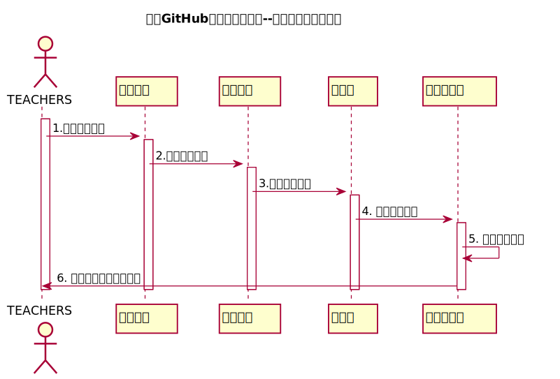

<!-- markdownlint-disable MD033-->
<!-- 禁止MD033类型的警告 https://www.npmjs.com/package/markdownlint -->

# “评分标准设置”用例 [返回](../README.md)
## 1. 用例规约

|用例名称|评分标准设置|
|-------|:-------------|
|功能|老师设置一个课程的实部分实验评分标准|
|参与者|老师|
|前置条件|设置评定标准之前，老师需要先登录，并显示出所有课程信息|
|后置条件| 设置评定标准之后，系统自动更新当前标准设定时间|
|主事件流| 1. 查看已有的课程信息   2. 输入一个或者多个实验评分标准    3. 提交    4. 系统存储评分标准  5. 系统自动生成设置日期|
|备选事件流|评分项与占比必须同时为空或者同时有值  |

## 2. 业务流程（顺序图） [源码](../src/sequenceEvaluate_principle.puml)
 

    
## 3. 界面设计
- 界面参照: https://jiangnhao.github.io/is_analysis_test6/ui/evaluate_principle.html

- API接口调用

    - 接口1：[setProgram_rate](../接口/setProgram_rate.md)
        
        用于设置相应实验的评分标准以及占比
        
    
## 4. 算法描述
    无
    
## 5. 参照表

- [COURSE](../Database.md/#COURSE)
- [GRADES](../Database.md/#GRADES)
- [TESTS](../Database.md/#TESTS)

