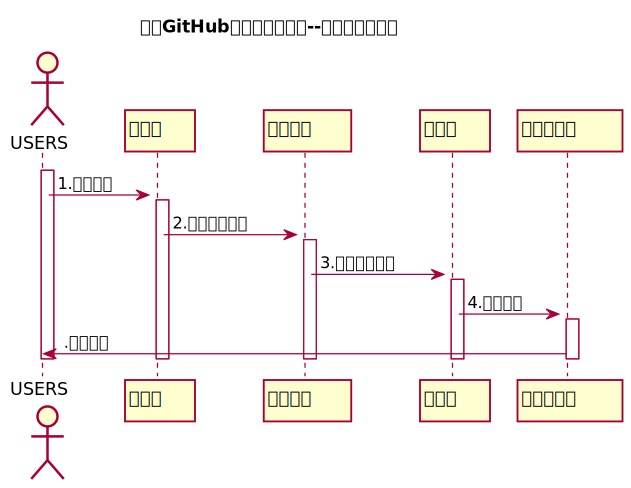

<!-- markdownlint-disable MD033-->
<!-- 禁止MD033类型的警告 https://www.npmjs.com/package/markdownlint -->

# “查看成绩”用例 [返回](../README.md)
## 1. 用例规约

|用例名称|查看成绩|
|-------|:-------------|
|功能|查看每个学生实验的实验成绩及实验评价|
|参与者|老师|
|前置条件|需要先登录，并进入某一课程的成绩页面|
|后置条件| 成功打开成绩页面|
|主事件流| 1用户进入系统的登陆界面。 2输入正确的用户名和密码，并且成功进入系统。 3在主界面进入某一课程，进入成绩列表。 |
|备选事件流| 无|

## 2. 业务流程（顺序图） [源码](../src/sequenceInquiry.puml)
 

## 3. 界面设计
- 界面参照: https://jiangnhao.github.io/is_analysis_test6/ui/inquiry.html
- API接口调用
    - 接口1：[getOneStudentResults](../接口/getOneStudentResults.md) 

## 4. 算法描述
    无
    
## 5. 参照表
- [STUDENTS](../Database.md/#STUDENTS)
- [GRADES](../Database.md/#GRADES)
- [TESTS](../Database.md/#TESTS)
- [COURSE](../Database.md/#COURSE)
