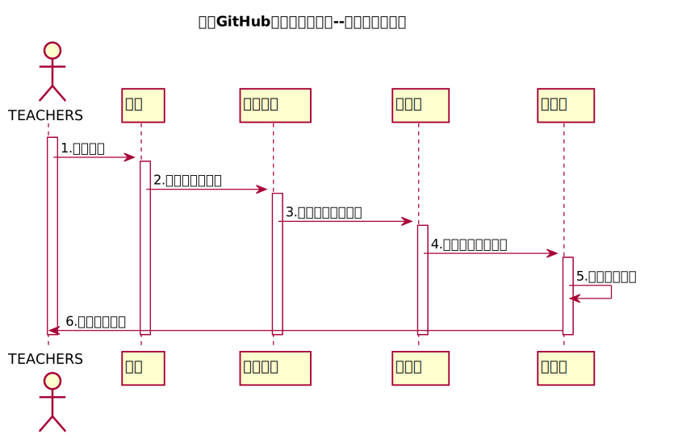

<!-- markdownlint-disable MD033-->
<!-- 禁止MD033类型的警告 https://www.npmjs.com/package/markdownlint -->

# “学生列表”用例 [返回](../README.md)
## 1. 用例规约

|用例名称|查看学生列表|
|-------|:-------------|
|功能|修改用户的密码|
|参与者|老师|
|前置条件|1教师已经成功登录到系统，进入主界面 |
|后置条件|用户可以按相应的条件查看学生列表|
|主事件流|1用户进入系统的登陆界面。  2输入正确的用户名和密码，并且成功进入系统。 3在主界面上了选择教学列表的某一课程。 4.进入课程内的学生名单。|
|备选事件流|无 |

## 2. 业务流程（顺序图） [源码](../src/sequenceStu_list.puml)
 

## 3. 界面设计
- 界面参照: [界面](https://jiangnhao.github.io/is_analysis_test6/ui/student_list.html)
- API接口调用
    - 接口1：[getStudents](../接口/getStudents.md) 

## 4. 算法描述

- WEB_SUM解析为列表  
  - WEB_SUM是接口getStudents的返回值中的一部分，形如："WEB_SUM": "Y,Y,Y,Y,Y,N"。需要在前端进行解析。  
  - 作用是判断GitHub网址是否正确，用逗号分开，Y代表正确，N代表不正确。  
  - 第1位代表总的GitHUB地址是否正确，第2位表示第1次实验的地址，第3位表示第2位实验地址，依此类推。
  - 比如：“Y,Y,Y,Y,Y,N”表示第5次实验地址不正确，其他地址正确。  
  - 算法是使用使用字符串分离方法将其分开。

- RESULT_SUM解析为列表
    - RESULT_SUM是接口getStudents的返回值中的一部分，形如："RESULT_SUM": "81.25,70,80,85,90,N"。需要在前端进行解析。
    - 成绩汇总（来自GRADES表），以逗号分开，第一个成绩是平均成绩,后面是每次实验的成绩，N表示未批改，平均分只计算已批改的。    
    - 比如：“81.25,70,80,85,90,N”表示一共批改了4次，第5次未批改，4次的成绩分别是81.25,70,80,85,90,N，4次的平均分是81.25
    - 算法是使用使用字符串分离方法将其分开。
    
## 5. 参照表

- [STUDENTS](../DataBase.md/#STUDENTS)
- [SCORES](../DataBase.md/#SCORES)
- [TESTS](../DataBase.md/#TESTS)
- [COURSES](../DataBase.md/#COURSES)

